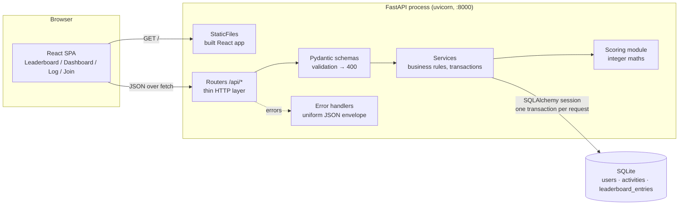
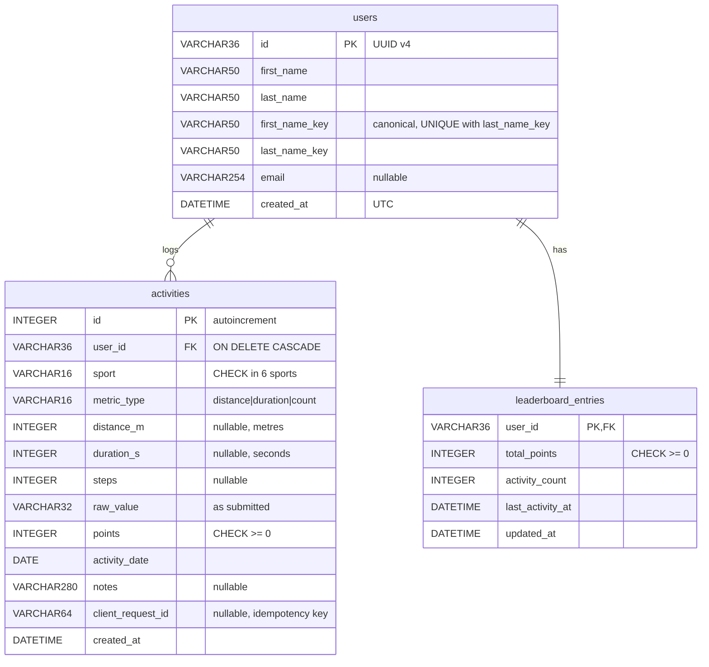

# Fitness Challenge: Software Design Document

A full-stack app that turns running, walking, cycling, swimming, gym and daily steps into one points currency, so people with different exercise habits compete on a single leaderboard.

| Layer | Choice | Why |
|---|---|---|
| Frontend | React 18 + Vite, Recharts, React Router (HashRouter) | Component model fits the leaderboard/dashboard split; Recharts gives accessible SVG charts with little code |
| Backend | Python 3.10+, FastAPI, Pydantic v2 | Declarative request validation, automatic OpenAPI docs at `/docs` |
| Persistence | SQLite via SQLAlchemy 2.0, in-memory by default | Zero setup; switch to a file with one env var |
| Tests | pytest + FastAPI TestClient (39 tests) | Scoring edge cases, validation, concurrency, ranking |

---

## a. System architecture & data flow



**Single process, single origin.** `npm run build` writes the React bundle into `backend/app/static`, and FastAPI serves it next to the API. One port, no CORS in production, one command to start. During development Vite runs on :5173 and proxies `/api` to :8000.

**Layering.** Routers only translate HTTP ↔ Python. Schemas own input validation. Services own business rules and transaction boundaries. `scoring.py` is pure functions with no I/O, so it is trivially unit-tested.

### Registration flow (`POST /api/users`)

1. Pydantic validates `firstName`, `lastName` (letters, spaces, `-`, `'`, `.`; 1–50 chars) and optional `email`. Unknown fields are rejected. Failure → **400**.
2. Service computes canonical keys: Unicode NFKC, whitespace collapsed, case-folded (`"  PRIYA "` → `"priya"`).
3. Fast-path lookup on `(first_name_key, last_name_key)`; a hit → **409 DUPLICATE_USER** (with `existingUserId` so the UI can offer "That's me").
4. Insert `users` row plus its `leaderboard_entries` row (0 points) in one transaction.
5. If two identical requests race past step 3, the `UNIQUE` constraint rejects the second commit; the service catches `IntegrityError`, re-reads and returns 409. Response **201** `{ userId, ... }` with a `Location` header.

### Activity ingestion flow (`POST /api/activities`)

1. Pydantic validates the envelope (types, enums, `extra="forbid"`), then a model validator checks the sport ↔ metricType pairing (**400 SPORT_METRIC_MISMATCH**) and the value's type, format and bounds (**400 VALIDATION_ERROR**). Valid values are converted to exact integers (metres, seconds, steps).
2. Service confirms the user exists (**404 USER_NOT_FOUND**).
3. If `clientRequestId` was already used by this user, the original activity is returned with **200** and `Idempotent-Replay: true`. Nothing is written twice.
4. For steps, one entry per user per day (**409 DAILY_STEPS_EXISTS**).
5. Points are calculated, the activity is inserted, and `leaderboard_entries` is incremented with an atomic `UPDATE … SET total_points = total_points + :p`, all in **one transaction**. Response **201** with the normalised value and awarded points.

---

## b. Database schema & data model



**Constraints and indexes**

| Object | Purpose |
|---|---|
| `uq_users_full_name UNIQUE(first_name_key, last_name_key)` | Duplicate-user guarantee at the storage layer |
| `ck_activity_metric_matches_sport` | Defence in depth: the DB rejects a running row with a duration, or a row with two metrics set |
| `uq_activity_client_request UNIQUE(user_id, client_request_id)` | Idempotent retries (NULLs don't collide, so the key is optional) |
| `uq_activity_daily_steps` partial UNIQUE `(user_id, activity_date) WHERE sport='steps'` | One daily-steps entry per user per day |
| `ix_activity_user_date`, `ix_activity_date` | Dashboard timeline and leaderboard trend queries |
| `ix_lb_total_points` | Ordering the leaderboard |
| `PRAGMA foreign_keys=ON` on every connection | SQLite ships with FK enforcement off |

**Why a `leaderboard_entries` table?** It is a materialised running total, updated in the same transaction as each activity. Reads become one scan of N users instead of `SUM()` over every activity ever logged. Because it is derived data, `services.rebuild_leaderboard()` can always recompute it from `activities`, which remain the source of truth.

**Duplicate user detection strategy.** Two layers: (1) a friendly pre-check that returns the existing user's id, and (2) the `UNIQUE` constraint on canonical keys, which is the actual guarantee and closes the race between check and insert. Canonicalisation means "Priya Raman", "priya raman" and "  PRIYA   RAMAN " are the same person, while "Priya Iyer" is not. The original casing is kept for display.

---

## c. API specifications

Base path `/api`. JSON in and out. Interactive OpenAPI docs: `http://localhost:8000/docs`.

### Error envelope (every non-2xx response)

```json
{ "error": { "code": "VALIDATION_ERROR", "message": "Request body failed validation.",
             "details": [ { "field": "value", "message": "distance supports at most 3 decimal places" } ] } }
```

| Status | Codes |
|---|---|
| 400 | `VALIDATION_ERROR`, `SPORT_METRIC_MISMATCH`, `INVALID_JSON` (FastAPI's default 422 is remapped to 400 as the spec requires) |
| 404 | `USER_NOT_FOUND`, `NOT_FOUND` |
| 409 | `DUPLICATE_USER`, `DAILY_STEPS_EXISTS` |
| 500 | `INTERNAL_ERROR` (logged server-side; no stack trace leaked) |

### `POST /api/users`: register

Request:
```json
{ "firstName": "Priya", "lastName": "Raman", "email": "priya@example.com" }
```
| Field | Rule |
|---|---|
| `firstName`, `lastName` | required string, 1–50 chars after trimming, letters (any script) with single spaces, `-`, `'`, `.` between parts; no digits |
| `email` | optional, basic format check, stored lower-case |
| any other field | rejected (400) |

Responses: **201** `{ "userId": "uuid", "firstName", "lastName", "email", "createdAt", "totalPoints": 0, "activityCount": 0 }` · **400** · **409** `DUPLICATE_USER` (+ `existingUserId`).

### `POST /api/activities`: ingest

```json
{ "userId": "3f1c…", "sport": "running",  "metricType": "distance", "value": 5.25 }
{ "userId": "3f1c…", "sport": "swimming", "metricType": "duration", "value": "45:30" }
{ "userId": "3f1c…", "sport": "steps",    "metricType": "count",    "value": 8500,
  "activityDate": "2026-10-06", "notes": "Office day", "clientRequestId": "a8f1-…" }
```

| Field | Rule |
|---|---|
| `userId` | required, UUID format (400) and must exist (404) |
| `sport` | one of `running, walking, cycling, swimming, gym, steps` |
| `metricType` | must match the sport: distance → running/walking/cycling; duration → gym/swimming; count → steps. Otherwise **400 SPORT_METRIC_MISMATCH** |
| `value` (distance) | JSON number of km, > 0, ≤ 1000, max 3 decimal places (metre precision). Strings, booleans, NaN/Infinity rejected |
| `value` (duration) | `"min:sec"` string, minutes 0–1440, seconds `00`–`59`, total > 0 and ≤ 24 h |
| `value` (count) | JSON integer, 1–200,000. Floats like `10.5` and strings rejected |
| `activityDate` | optional ISO date, default today, not in the future, not older than 365 days |
| `notes` | optional, ≤ 280 chars |
| `clientRequestId` | optional idempotency key, ≤ 64 chars |

Responses: **201** (new) or **200** with `Idempotent-Replay: true` (retry):
```json
{ "activityId": 237, "userId": "3f1c…", "sport": "walking", "metricType": "distance", "value": 1.55,
  "normalized": { "distanceKm": 1.55, "distanceMetres": 1550 }, "points": 77,
  "activityDate": "2026-10-07", "notes": null, "createdAt": "2026-10-07T17:40:47Z" }
```

### Read endpoints

| Method & route | Returns |
|---|---|
| `GET /api/leaderboard?trendDays=7&limit=` | Ranked entries: `rank`, `totalPoints`, `pointsInPeriod`, `previousRank`, `rankChange`, `trend` (`up/down/same/new`) |
| `GET /api/users` / `GET /api/users/{id}` | User list / one user with totals |
| `GET /api/users/{id}/dashboard?days=30` | Summary (rank, streak, active days, favourite sport), `bySport`, daily `timeline`, `cumulative`, `recentActivities` |
| `GET /api/activities?userId=&limit=50` | Activity log |
| `GET /api/scoring-rules` | Conversion table (single source of truth) |
| `GET /api/health` | Liveness + DB check |

---

## d. Scoring & normalisation logic

| Sport | Unit | Rate | Rule |
|---|---|---|---|
| Running | 1 km | 100 pts | `floor(km × 100)` |
| Walking | 1 km | 50 pts | `floor(km × 50)` |
| Cycling | 1 km | 25 pts | `floor(km × 25)` |
| Swimming | 1 full minute | 15 pts | `floor(seconds / 60) × 15` |
| Gym | 1 full minute | 5 pts | `floor(seconds / 60) × 5` |
| Daily steps | 100 steps | 1 pt | `floor(steps / 100)` |

**No floating point anywhere in the scoring path.** Values are converted to integers at the edge, and every formula is integer arithmetic:

```python
distance_m = int(Decimal(str(km)) * 1000)          # 1.55 km -> 1550 m, exact
points     = (distance_m * POINTS_PER_KM[sport]) // 1000   # 1550*50//1000 = 77
points     = (duration_s // 60) * POINTS_PER_MINUTE[sport] # "1:55" -> 115 s -> 1 min -> 15
points     = steps // 100                                   # 399 -> 3
```

Why this matters: in binary floating point `0.29 * 100 == 28.999999999999996`, so a naive `math.floor(km * rate)` awards 28 points for a 0.29 km run instead of 29. Converting through `Decimal(str(value))` to integer metres removes the problem; the test suite includes this case.

Limiting distance to 3 decimal places (1 m) loses nothing: every point boundary falls on a whole number of metres (every 10 m for running, 20 m walking, 40 m cycling), so flooring to metres can never change a score. Durations use `mm:ss`, so seconds are already integers.

Points are computed once at write time and stored on the activity. If rates ever change, historical activities keep the points they earned (a rescoring job would be an explicit decision, not a side effect).

---

## e. Frontend architecture & visualisations

```
src/
├── main.jsx            HashRouter + root render
├── App.jsx             top bar, routes
├── api.js              fetch wrapper, ApiError, idempotency key generator
├── sports.js           colours, labels, client-side points preview (mirrors scoring.py)
├── useCurrentUser.js   "who am I" stored in localStorage (no auth in scope)
├── components/
│   ├── UserPicker.jsx  select-your-name dropdown
│   └── Status.jsx      Loading, ErrorBox (renders server field errors)
└── pages/
    ├── Leaderboard.jsx  standings, period toggle, search, trend badges, 30 s auto-refresh
    ├── Dashboard.jsx    stats strip, stacked bar, volume area chart, sport-mix donut, recent table
    ├── LogActivity.jsx  sport picker, metric-specific inputs, live points preview
    └── Register.jsx     join form with duplicate-name recovery
```

**Global Leaderboard.** Ranked list with large rank numerals (gold/silver/bronze for the top three), athlete name linking to their dashboard, movement badge (▲/▼/–/New), points in the period and total points. The 7-day/30-day toggle re-requests `trendDays`. Data refreshes every 30 s and when the tab regains focus. The current user's row is marked.

**Personal Dashboard.** Four headline stats (rank with movement, total points, day streak, activity count), then:

| Visual | Chart | Data |
|---|---|---|
| Activity history | Stacked bar, one colour per sport | `timeline[]` points per sport per day (14/30/90-day window) |
| Volume over time | Area chart with measure toggle | cumulative points, or daily km / minutes / steps |
| Sport preference | Donut + legend with share, sessions and raw volume | `bySport[]` |
| Recent activities | Table | last 15 activities |

Any user's dashboard is viewable via `/dashboard/:id`, which makes the leaderboard explorable.

**Ranking strategy** (server-side, `services.leaderboard`):
- **Standard competition ranking** ("1-2-2-4"): tied totals share a rank and the next rank skips. Display order within a tie is alphabetical, which is stable and doesn't imply a hidden winner.
- **Trend**: the server recomputes each user's total as of the end of the day `trendDays` ago (`SUM(points) WHERE activity_date <= cutoff`), ranks that snapshot the same way, and returns `rankChange = previousRank − currentRank` (positive = climbed). Users who joined after the cutoff with no earlier activity are `new` rather than shown as a misleading jump.
- Ranks are computed on the server so every client agrees; the frontend never re-ranks.

The points preview on the log form mirrors the server formula for instant feedback, but the server always recomputes and its number is what gets stored and shown.

---

## f. Trade-offs & edge cases

### Trade-offs

| Decision | Benefit | Cost / mitigation |
|---|---|---|
| In-memory SQLite (default) | No setup, fast, clean slate per run | Data is lost on restart. Set `DATABASE_URL=sqlite:///./fitness.db` to persist; demo data is reseeded on an empty DB |
| Single shared connection + lock for in-memory mode | In-memory SQLite is per-connection, so sharing one connection is the only way the whole app sees one DB; the lock keeps transactions from interleaving | Writes are serialised. At ~1 ms per request that is hundreds of req/s, ample here. File mode uses a normal pool with WAL + busy timeout |
| Materialised `leaderboard_entries` | O(users) leaderboard reads | Two writes per activity, kept consistent by a single transaction and atomic `UPDATE x = x + n`; rebuildable from `activities` |
| Trend computed on read from activities | Always correct, no snapshot jobs | O(activities) query per leaderboard load; at scale replace with nightly `leaderboard_snapshots` |
| Points stored at write time | Fast reads, history stable if rules change | Rule changes need an explicit rescoring migration |
| Name-based identity (per spec) | Matches the requirement exactly | Two real people with the same name can't both join; a production system would use email or auth. Email is collected to make that move easy |
| No authentication | In scope for the assignment | Anyone can log activities for anyone; the "who am I" choice is a browser convenience only |
| Backend serves the built frontend | One process, one port, no CORS, easy to share | Frontend changes need `npm run build` (or use the Vite dev server) |
| HashRouter | Deep links work from static hosting with no server rewrite rules | URLs contain `#/` |

### Edge cases handled

| Case | Handling |
|---|---|
| Concurrent identical registrations | `UNIQUE` constraint + `IntegrityError` → 409. Test: 10 parallel requests → exactly one 201 and nine 409s |
| Concurrent activity posts for one user | Serialised transaction + atomic increment. Test: 80 parallel posts → total exactly 8,000 |
| Double-click / network retry | `clientRequestId` returns the original activity (200, `Idempotent-Replay`). The UI generates one key per form submission |
| Floating-point flooring errors | Integer metres via `Decimal` (0.29 km running = 29, not 28) |
| Sub-unit activity (0.039 km cycling, 0:59 gym, 99 steps) | Accepted, scores 0 points (spec floors; the activity is still history) |
| Wrong value type | `"5"` for distance, `10.5` steps, `30` (number) for duration, `true` anywhere → 400 (strict types; booleans are not numbers) |
| `NaN` / `Infinity` | Python's JSON parser accepts them; explicitly rejected |
| Malformed duration | `"1:60"`, `"1:5"`, `":30"`, `"1:00:00"` → 400 |
| Absurd values | Bounds: ≤1000 km, ≤24 h, ≤200,000 steps → 400 |
| Future / ancient dates | Future or >365 days ago → 400 |
| Second steps entry same day | 409 `DAILY_STEPS_EXISTS` |
| Unknown or extra fields | `extra="forbid"` → 400 (catches typos like `"distnace"`) |
| Malformed JSON | 400 `INVALID_JSON` |
| Non-existent user / bad UUID | 404 / 400 respectively |
| Name variants | Case, spacing and Unicode-normalisation-insensitive duplicate check |
| Leaderboard ties | Shared rank, skip next |
| Stale saved user id in the browser | Dashboard 404 clears it and shows the picker |
| `crypto.randomUUID` unavailable (HTTP over LAN is not a secure context) | Fallback id generator |
| Unknown `/api/*` route | JSON 404, never the HTML app |
| Unhandled exceptions | Logged; client gets a generic 500 envelope with no internals |

### What I'd add for production
Authentication (OAuth / email magic link) and per-user authorization; PostgreSQL with the same schema; Alembic migrations; rate limiting on POST endpoints; leaderboard snapshots and caching; pagination on activity lists; structured logging and metrics; containerised deployment with CI running the test suite.
